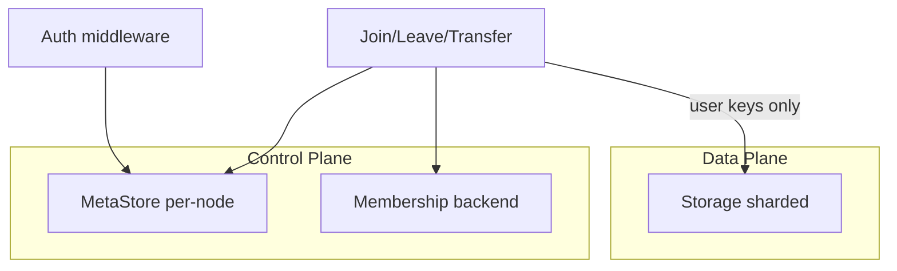
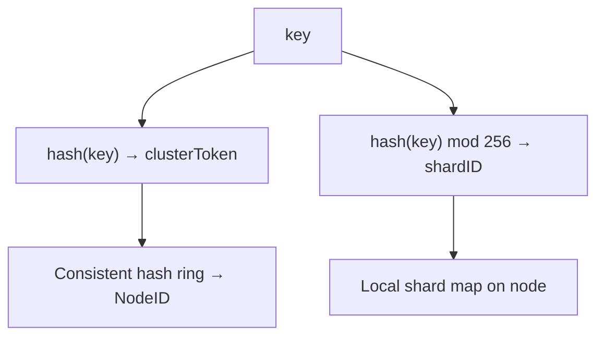
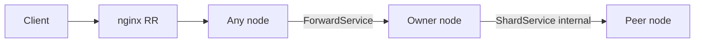

# Go Distributed KV Store Library — Project Prompt

## What I Am Building

A Go **library** (not an application) that provides composable, pluggable building blocks for
distributed key-value stores. Users wire together provided implementations or supply their own
via interfaces. Everything works out of the box but nothing is locked in.

This is a plugin-style architecture:
- HTTP and gRPC server/client transports provided; users swap either out
- In-memory map and bbolt storage backends provided; users implement `Storage` for any backend
- Consistent hash ring, static shard map, passthrough routers provided
- Interfaces are intentionally minimal to ensure generalisation across backends

---

## Design Philosophy

- **Interface-driven** — core operations defined as minimal Go interfaces
- **Pluggable** — storage, transport, routing, replication, auth all swappable independently
- **Composable** — single node, sharded node, multi-node cluster are different compositions of the same parts
- **Batteries included** — reference implementations for all common cases
- **Incremental** — simple single-node works first, complexity layered on top
- **No lock-in** — a Redis-backed storage only needs to implement `Get`, `Put`, `Delete` (and `Scan` where needed)
- **Learning-oriented** — where external libraries exist (bbolt, hashicorp/raft), the library also provides a from-scratch implementation so internals are understood
- **Data/control plane separation** — user KV data and cluster metadata stored and managed independently; redistribution never migrates control-plane state through the user-data transfer protocol

### Data plane vs control plane

| Plane | What it stores | Sharded? | Moved on redistribution? |
| ----- | -------------- | -------- | ------------------------ |
| **Data plane** | User keys/values via `Storage` | Yes (hash ring) | Yes — keys transfer node-to-node |
| **Control plane** | Cluster ops, transfer state, node identity, credentials | No | No — stays local or in dedicated cluster backend |

**Invariant**: shard redistribution must never require migrating control-plane state through the user-data transfer protocol. Transfer checkpoints live in `MetaStore`, not in sharded user `Storage`.



---

## MVP Scope

Use this table as a filter — anything in the Deferred column is present for design completeness but not required to build.

| In MVP | Deferred |
| ------ | -------- |
| gRPC internal transport + HTTP/gRPC client-facing | Coordinated cluster-wide Scan snapshot |
| Consistent hash ring + peer-to-peer forwarding hops | Merkle root verification during cutover |
| Static + in-memory dynamic membership | HLC timestamps |
| Shard transfer + join/leave/failure redistribution | Static API key auth (Phase 7) |
| Leaderless quorum replication (N/W/R) | JWT, RBAC |
| mTLS on internal cluster gRPC (Phase 4) | Gossip and Raft membership backends |
| `Entry` envelope for TTL and versioning | Distributed / cross-shard transactions |
| LBConfigSync for scaling | CASStorage implementations (Phase 7) |

---

## Deployment Topologies

Three first-class deployment modes, all composable from the same parts:

| Mode | Client entry point | Routing knowledge | When to use |
| ---- | ------------------ | ----------------- | ----------- |
| **Dumb LB + peer forwarding** | nginx/HAProxy round-robin | None on client or LB | Simple ops, curl-friendly, minimal client logic |
| **Smart gateway** | Dedicated gateway tier | Gateway holds `Router` + `Membership` | Central auth, rate limits, no forwarding hops |
| **Smart client** | SDK with embedded `Router` | Client holds ring; talks directly to owner | Lowest latency, no gateway SPOF |

### Dumb LB + peer forwarding (default, MVP topology)

- Round-robin LB distributes requests across all active nodes
- LB has no hash-ring knowledge — it just picks a node
- The receiving node hashes the key, checks the ring, forwards to the owner if needed via `ForwardService`
- **`LBConfigSync`** watches `Membership` and updates the LB backend list when nodes join or leave
- A node is only added to the LB pool after it reaches `StateReady` — never during transfer

**LB pool timing during node transitions:**

| Node state | In LB pool? | Receives client traffic? |
| ---------- | ----------- | ------------------------ |
| `Receiving` | No | No — internal only |
| `Ready` / `Active` | Yes | Yes |
| `TransferringOut` | Yes (draining) | Yes, forwards owned keys; new writes go to successor |

### Smart gateway (Phase 5b)

- Gateway composes `Router`, `Membership`, `NodePool`, and auth
- Routes directly to the owning node — no forwarding hop
- Storage nodes run internal port only (`StorageOnly` role)

### Smart client (Phase 5b)

- Client SDK embeds `Router` and `NodePool`
- Connects directly to owning node — no gateway, no forwarding

---

## Core Conventions

- **Value type is `[]byte`** throughout — transport-agnostic, users serialize on top
- **Keys are `string`** — natural, immutable, safe as map keys
- **Every interface method accepts `context.Context` as first argument** — no exceptions
- **Error types are defined by the library** — callers distinguish by type, not string matching:
  - `ErrKeyNotFound`
  - `ErrThrottled`
  - `ErrNotOwner`
  - `ErrNodeUnavailable`
  - `ErrTransferInProgress`
  - `ErrUnauthorized`
  - `ErrInvalidArgument`
- **Ports are configurable** — never hardcoded. Convention: client-facing on one port, internal cluster on another.
- **slog for logging** — stdlib since Go 1.21, no external dependency. Every component accepts an optional `*slog.Logger`. If nil, a no-op logger is used.
- **Key/value size limits** — configurable max key size (default 1 KB), max value size (default 1 MB). Violations return `ErrInvalidArgument`.

---

## Internal Storage Format — Entry Envelope

All storage implementations wrap user values in an internal `Entry` envelope. This is an implementation detail of the storage layer — invisible to transport and routing layers.

```go
type Entry struct {
    Value     []byte
    ExpiresAt int64  // unix nano; 0 = no expiry
    Version   uint64 // incremented on every write; used for CAS and replication conflict resolution
}
```

`Version` starts at 1 on first write and increments on every `Put`. It is never set by callers directly.

`ExpiresAt` is checked on every `Get` — expired entries return `ErrKeyNotFound` and are lazily deleted. A background sweeper per shard handles proactive cleanup.

The envelope is serialized to bytes (JSON in v1 for debuggability) before being written to the backend. The backend only ever sees `[]byte`.

**`Entry.ExpiresAt` and `TTLStorage`** — these coexist. `TTLStorage.PutWithTTL` is a convenience API that converts `time.Duration` into `Entry.ExpiresAt` before writing. Both mechanisms write the same field; `TTLStorage` signals that a backend can schedule native expiry.

---

## Package Structure

```
kvstore/
  storage/      — Storage interface + all implementations (in-memory, bbolt, WAL)
  meta/         — MetaStore interface + implementations (in-memory, bbolt)
  transport/    — TransportServer, TransportClient + HTTP/gRPC implementations
  cluster/      — NodePool, hash ring, shard map, membership, LBConfigSync
  replication/  — Replicator interface + leaderless quorum + leader-based
  node/         — wires all layers into a working node; NodeRole config
  gateway/      — smart gateway (Phase 5b)
  client/       — cluster-aware Client facade
  security/     — Authenticator, Authorizer, TLS helpers
  proto/        — protobuf definitions for all gRPC services
  observe/      — Metrics, StateInspector, structured state types
  testing/      — mock implementations of all interfaces for user tests
```

---

## Interface Layers

### Storage (data plane)

User-facing key-value storage. Subject to sharding, replication, and redistribution.

```go
// Core — all implementations must satisfy this
type Storage interface {
    Get(ctx context.Context, key string) ([]byte, error)
    Put(ctx context.Context, key string, value []byte) error
    Delete(ctx context.Context, key string) error
}

// Required for shard transfer and rebalancing
type ScanStorage interface {
    Storage
    Scan(ctx context.Context, fn func(key string, value []byte) error) error
}

// Optional — backends that support TTL natively
type TTLStorage interface {
    Storage
    PutWithTTL(ctx context.Context, key string, value []byte, ttl time.Duration) error
}

// Optional — backends that support atomic operations
type CASStorage interface {
    Storage
    CompareAndSwap(ctx context.Context, key string, oldVal, newVal []byte) (bool, error)
}
```

Reference implementations:
- **In-memory map with RWMutex** — implements `Storage` + `ScanStorage` + `TTLStorage`. TTL via `Entry.ExpiresAt` + background sweeper.
- **bbolt** — implements `Storage` + `ScanStorage`. bbolt handles durability internally.
- **Hand-rolled WAL-backed store** — learning implementation. Append-only WAL, recovery on startup, compaction.

### API Hierarchy

```
Storage.Get / Put / Delete          — MVP (Phase 1)
CASStorage.CompareAndSwap           — MVP interface; implementations in Phase 7
ScanStorage.Scan                    — required for shard transfer (Phase 2)
TTLStorage.PutWithTTL               — convenience wrapper over Entry.ExpiresAt (Phase 2)
Batch (atomic multi-key, one node)  — post-MVP
Transaction (single-node ACID)      — post-MVP
Distributed transaction             — out of scope v1
```

### Control Plane Storage (MetaStore)

Operational metadata — transfer state, node identity, credentials. **Not** sharded, **not** routed through the hash ring, **not** transferred during redistribution.

```go
type MetaStore interface {
    Get(ctx context.Context, key string) ([]byte, error)
    Put(ctx context.Context, key string, value []byte) error
    Delete(ctx context.Context, key string) error
    Scan(ctx context.Context, prefix string, fn func(key string, value []byte) error) error
}
```

Reference implementations: in-memory map (dev/testing), bbolt file (`meta.db` alongside user data).

**Why a separate store?** Cluster state cannot live in the same store it is managing — if the store is mid-rebalance it cannot reliably serve its own control-plane reads. This is the circular dependency problem.

**Three tiers of state:**

| Tier | Store | Consistency | Example data |
| ---- | ----- | ----------- | ------------ |
| **User data** | `Storage` (sharded) | Per-key owner / quorum | User keys |
| **Local control** | `MetaStore` (per-node) | Local durability | Transfer checkpoints, hints, credentials |
| **Cluster coordination** | `Membership` backend | Strongly consistent | Node registry, liveness, ring generation |

**Why etcd for dynamic cluster (Phase 5)?** Membership decisions require strong consistency — two nodes with different views of membership during a transfer produce split-brain. etcd provides a strongly-consistent coordination layer independent of the data plane, with a watch/lease API that drives `MembershipEvent` notifications. Static config works for MVP; etcd is the Phase 5 production reference.

**Meta key namespace:**

| Prefix | Purpose |
| ------ | ------- |
| `node/` | Node identity, local config |
| `transfer/` | In-flight shard transfer checkpoints |
| `hints/` | Hinted handoff buffer (replication) |
| `auth/` | API key hashes, credentials |

User keys **never** share a `MetaStore`. Strict namespace separation enforced by convention.

### Transport (client-facing)

```go
type TransportServer interface {
    Serve(ctx context.Context, handler RequestHandler) error
    Shutdown(ctx context.Context) error
}

type TransportClient interface {
    Get(ctx context.Context, addr string, key string) ([]byte, error)
    Put(ctx context.Context, addr string, key string, value []byte) error
    Delete(ctx context.Context, addr string, key string) error
}
```

Reference implementations: HTTP and gRPC. HTTP is valid for client-facing — easy to test with curl. `TransportClient` is low-level (address per call) and used internally. Application code uses the `Client` facade.

### Cluster transport (internal node-to-node)

gRPC only. HTTP is not suitable for internal traffic:
- Native streaming for shard transfer
- HTTP/2 multiplexing — heartbeat and replication traffic run concurrently on one connection
- Typed protobuf contracts
- Bidirectional streaming for replication

### Routing

```go
type Router interface {
    Route(key string) (addr string, err error)
}
```

Reference implementations: passthrough (single node), consistent hash ring (default multi-node), static shard map (predefined key-range → node).

### Consistency & Conflict Resolution

| Topology | Replication | Caller guarantee | Conflict resolution |
| -------- | ----------- | ---------------- | ------------------- |
| Single node, no replication | none | linearizable | n/a |
| Sharded, no replication | none | per-key owner is authoritative | n/a |
| Leaderless quorum | N/W/R | tunable: `R+W > N` → read-your-writes possible | LWW via `(Entry.Version uint64, NodeID)` |
| Leader-based (Raft) | per-shard leader | linearizable per shard | Raft log ordering |

> Static membership: split-brain requires manual operator intervention. Automatic detection requires a dynamic membership backend (Phase 5+).

Write descriptor shared by replication and shard transfer:

```go
type OpType int

const (
    OpPut    OpType = iota
    OpDelete
)

type Operation struct {
    Type    OpType
    Key     string
    Value   []byte
    Version uint64 // from Entry.Version; used for LWW conflict resolution across replicas
}
```

Split-brain handling by backend: static config → manual; gossip → version vectors; Raft → prevented by consensus.

`ErrNotOwner` is returned only when forwarding is disabled or hop limit exceeded — not to external clients in dumb-LB or gateway modes.

### Replication

```go
type Replicator interface {
    Write(ctx context.Context, op Operation) error
    Read(ctx context.Context, key string) ([]byte, error)
}
```

Reference implementations: leaderless quorum (configurable N, W, R), leader-based (Phase 7).

- **Hinted handoff** — when a replica is unavailable, writes are stored under `hints/` in `MetaStore` and delivered on recovery
- **Read repair** — stale reads trigger background repair to the latest version
- **Conflict resolution** — leaderless uses Last Write Wins via `(Entry.Version, NodeID)` tuple

### Cluster Membership

```go
type Membership interface {
    Members() []NodeInfo
    Join(ctx context.Context, node NodeInfo) error
    Leave(ctx context.Context, nodeID string) error
    Watch(ctx context.Context, fn func(event MembershipEvent)) error
}

type MembershipEvent struct {
    Type NodeEventType // NodeJoined, NodeLeft, NodeFailed
    Node NodeInfo
}
```

Reference implementations:
- **Static config** — dev and MVP. No external dependency.
- **In-memory dynamic** — no external dependency; fires `MembershipEvent` on `Join`/`Leave`; used for Phase 5 integration testing without etcd
- **etcd-backed** — Phase 5 production reference; strongly consistent watch/lease API
- **Gossip / Raft-backed** — Phase 7 learning paths

### Security

```go
type Principal interface {
    ID() string
}

type Authenticator interface {
    Authenticate(ctx context.Context, token []byte) (Principal, error)
}

type Authorizer interface {
    Authorize(ctx context.Context, p Principal, op string, key string) error
}
```

Auth runs before routing and replication. Wire points:
- gRPC: unary + stream interceptors on `TransportServer` and gateway
- HTTP: middleware wrapper

mTLS on internal cluster gRPC is added in **Phase 4** — mandatory from the first multi-node deployment. Running an unencrypted cluster network is a security risk. The library wires TLS via `*tls.Config`; cert provisioning is the operator's responsibility.

Reference implementations: **noop** (Phase 1 default), **static API key** backed by `MetaStore` under `auth/` (Phase 7), **JWT** (Phase 7).

```go
type TLSConfig struct {
    Config *tls.Config // user-provided; library never generates certs
}
```

### NodePool

Persistent gRPC connections to peer nodes:

```go
type NodePool interface {
    Get(ctx context.Context, addr string) (NodeConn, error)
    Close() error
}
```

- One persistent connection per peer, created at startup, reused for all RPCs
- Never open/close per request
- gRPC handles reconnection on transport failure — just retry the RPC
- Keepalive config must match client and server or connections drop silently
- Retryable: `Unavailable`, `ResourceExhausted`. Never retry: `NotFound`, `InvalidArgument`

### Client facade

```go
type Client interface {
    Get(ctx context.Context, key string) ([]byte, error)
    Put(ctx context.Context, key string, value []byte) error
    Delete(ctx context.Context, key string) error
}
```

Internally uses `Router` + `NodePool` to reach the correct node directly (smart client mode) or sends to any node and lets forwarding handle it (dumb LB mode).

---

## Node Architecture

### Node roles

```go
type NodeRole int // ClientFacing | StorageOnly | Gateway
```

| Role | Client port | Internal port | DataStore | MetaStore |
| ---- | ----------- | ------------- | --------- | --------- |
| `ClientFacing` | `KVService` | all cluster services | yes | yes |
| `StorageOnly` | none | all cluster services | yes | yes |
| `Gateway` | `KVService` | membership only | no | yes (in-memory) |

Every `ClientFacing` and `StorageOnly` node is simultaneously a gRPC **server** on two configurable ports and a gRPC **client** maintaining persistent connections to all peers via `NodePool`.

### NodeConfig

```go
type NodeConfig struct {
    Role       NodeRole
    ID         string
    Addr       string
    Logger     *slog.Logger
    DataStore  Storage      // user data plane
    MetaStore  MetaStore    // control plane — separate backing store
    Router     Router
    Pool       NodePool
    Membership Membership
    Replicator Replicator   // optional
    Auth       Authenticator
    Authz      Authorizer
    Metrics    Metrics      // optional
}
```

Internal components (transfer checkpoints, hinted handoff buffer, dedup cache) are constructed by the node from `MetaStore` — they are not exposed on `NodeConfig`.

Gateway: `DataStore` is nil; all other fields as above.

---

## Sharding Architecture

Two independent levels:



**Cluster level** — consistent hash ring maps keys to owning nodes
- Virtual nodes (100–200 per physical node) smooth uneven distribution
- Adding/removing a node only remaps keys in the affected range

**Node level** — each node maintains a local shard map (~256 shards)
- Concurrency partitioning only — not independently moveable across nodes
- Each shard has its own RWMutex — concurrent ops on different ranges do not block each other
- Each shard has its own token bucket for burst capacity
- Powers of 2 for shard count makes modulo a cheap bitwise op (`h & 0xFF`)

Key lookup path:
```
key → hash → cluster token → NodeID    (via hash ring)
key → hash mod 256 → local shard       (concurrency partition)
```

**Ownership source of truth**: `Membership` + `Router` generation number. Nodes reject writes for stale generations (`ErrTransferInProgress`).

---

## Cluster Redistribution

Redistribution moves **user keys only** via `ShardService`. Control-plane state stays in `MetaStore` — never streamed through `TransferShard`.



### Node join

When new node D joins and claims a range owned by node A:

1. D announces `StateReceiving` to the cluster (`Membership` assigns a generation token)
2. A scans its `DataStore` for keys in D's range
3. A streams keys to D via `TransferShard` (streaming gRPC)
4. During transfer: **writes go to both A and D, reads go to A only**
5. Transfer checkpoint saved in `MetaStore` under `transfer/`
6. D announces `StateReady`
7. Cluster switches: all reads and writes now go to D
8. `LBConfigSync` adds D to the LB pool
9. A deletes its copy of the transferred keys

The double-write window ensures writes during transfer are not lost.

**Cutover criteria** — D is ready when:
1. Bulk `TransferShard` stream completes with a checkpoint persisted in `MetaStore`
2. D has applied all double-writes since checkpoint (tracked via per-shard sequence number)

> Post-MVP: optional Merkle root comparison as an integrity check.

### Node leave (graceful)

1. `LBConfigSync` removes node from LB pool — stop new traffic immediately
2. Drain in-flight requests
3. Transfer ranges to successor(s) — same protocol as join
4. `Membership.Leave` — ring generation bumps
5. Node shuts down

### Node failure

1. Heartbeat timeout detected via `ClusterService`
2. `Membership` marks node dead
3. Successors initiate transfer from last checkpoint in `MetaStore`
4. Failed node removed from LB pool
5. If replication enabled: prefer replica as transfer source

### Failure recovery

| Failure | Behaviour |
| ------- | --------- |
| D crashes mid-transfer | Predecessor continues serving; transfer restarts from checkpoint |
| Predecessor crashes mid-transfer | D discards partial state; new owner re-transfers |
| Concurrent joins on same range | `Membership` serializes via generation token; second join rejected |
| Write during transfer | Double-write to both; sequence numbers in `MetaStore` ensure ordering |

Forwarded requests carry an `x-forwarded` metadata flag to prevent infinite forwarding loops.

---

## LB Config Sync

`LBConfigSync` watches `Membership` and pushes updated backend lists to the LB when nodes transition state.

```go
type LBConfigSink interface {
    Apply(ctx context.Context, backends []Backend) error
}
```

Reference sinks: file writer (nginx `upstream` block), stdout (sidecar), noop. The LB needs no ring knowledge — `LBConfigSync` is the only bridge between cluster state and the LB.

---

## Spike Handling vs Node Autoscaling

Node autoscaling is **not** suitable for traffic spikes — DynamoDB's own docs state it only triggers after 2+ minutes of sustained load; total latency from spike to new capacity is ~3–5 minutes.

Correct tools for spikes (all in-process, microsecond response):

**Token bucket per shard** — accumulates unused capacity. During a spike, stored tokens absorb load without throttling.

**Adaptive capacity** — hot shards borrow from a global node-level pool when their own bucket is exhausted.

| Spike duration | Right tool |
| -------------- | ---------- |
| Seconds | Per-shard token bucket |
| Minutes | Adaptive capacity (global pool) |
| Hours+ | Add nodes (planned, off-peak) |

---

## Transactions and Batches

Explicitly deferred to post-MVP but designed to avoid breaking changes.

| Operation | Scope | Phase |
| --------- | ----- | ----- |
| `Put / Get / Delete` | single key | Phase 1 |
| `CAS` (via `CASStorage`) | single key, optimistic | Phase 7 |
| `Batch` | multi-key atomic, single node | post-MVP |
| `Transaction` | multi-key read-write, single node | post-MVP |
| Distributed transaction | cross-node | out of scope v1 |

`Entry.Version` exists from Phase 1, so CAS can be added to any implementation without a storage format change.

---

## Observability

### Logging

`slog` throughout. Structured fields: `node_id`, `shard_id`, `operation`, `key_hash` (not raw key), `duration_ms`, `error`.

### Metrics

```go
type Metrics interface {
    RecordOperation(op string, duration time.Duration, err error)
    RecordShardSize(shardID uint32, keys int)
    RecordTokenBucket(shardID uint32, tokens float64)
    RecordReplication(success bool, duration time.Duration)
    RecordTransfer(shardID uint32, keys int, duration time.Duration)
}
```

Not coupled to any metrics library. User wires in Prometheus, OpenTelemetry, or anything else. Nil = noop.

### State inspection

Every component exposes a `State()` method returning a structured snapshot:

```go
type NodeState struct {
    ID              string
    Addr            string
    Status          NodeStatus
    ShardCount      int
    Shards          []ShardState
    PeerCount       int
    Peers           []PeerState
    PendingHints    int
    ActiveTransfers []TransferSummary
}

type ShardState struct {
    ID        uint32
    KeyCount  int
    Tokens    float64     // current token bucket level
    Status    ShardStatus // Active, Transferring, Receiving
    OwnerNode string
}

type ClusterState struct {
    Nodes       []NodeState
    TotalKeys   int
    TotalShards int
    RingHash    uint32  // fingerprint of current ring config
}

type StorageState struct {
    Implementation string
    KeyCount       int
    SizeBytes      int64
}

type MetaStoreState struct {
    Implementation string
    SizeBytes      int64
}
```

`ClusterState` is an assembled read snapshot — not persisted. Built from `Membership` + local `MetaStore` + `Storage` stats on demand.

Exposed via optional `/debug/state` HTTP endpoint on the client-facing server and loggable on demand via slog.

### Graceful shutdown

1. Stop accepting new requests
2. Drain in-flight requests (configurable timeout)
3. Complete or checkpoint active transfers
4. `Membership.Leave`
5. `TransportServer.Shutdown`

---

## gRPC Service Definitions

### Client-facing (configurable port)

Bound on `ClientFacing` and `Gateway` roles.

```protobuf
service KVService {
    rpc Get(GetRequest) returns (GetResponse);
    rpc Put(PutRequest) returns (PutResponse);
    rpc Delete(DeleteRequest) returns (DeleteResponse);
    rpc Scan(ScanRequest) returns (stream ScanResponse);
}
```

### Internal cluster (separate configurable port)

Bound on `ClientFacing` and `StorageOnly` roles.

```protobuf
// Forwarding — when a node receives a request it does not own
// x-forwarded metadata flag prevents infinite loops
// Not used on smart gateway hot path
service ForwardService {
    rpc Forward(ForwardRequest) returns (ForwardResponse);
}

// Write propagation to replicas
service ReplicationService {
    rpc Replicate(ReplicateRequest) returns (ReplicateResponse);
    rpc ReplicateStream(stream ReplicateRequest) returns (ReplicateResponse);
}

// Shard transfer — user keys only; control-plane state stays in MetaStore
service ShardService {
    rpc TransferShard(stream ShardChunk) returns (TransferResponse);
    rpc ShardInfo(ShardInfoRequest) returns (ShardInfoResponse);
}

// Cluster membership and liveness
service ClusterService {
    rpc Heartbeat(HeartbeatRequest) returns (HeartbeatResponse);
    rpc Join(JoinRequest) returns (JoinResponse);
    rpc Leave(LeaveRequest) returns (LeaveResponse);
    rpc ClusterState(ClusterStateRequest) returns (ClusterStateResponse);
}

// Leader election — two paths:
// (a) Hand-rolled using this proto — for learning
// (b) hashicorp/raft — owns its own transport, RaftService proto not used
service RaftService {
    rpc RequestVote(VoteRequest) returns (VoteResponse);
    rpc AppendEntries(AppendRequest) returns (AppendResponse);
}
```

---

## Incremental Build Plan

```mermaid
flowchart LR
  P1[Phase1_Foundation] --> P2[Phase2_Persistence]
  P2 --> P3[Phase3_Sharding]
  P3 --> P4[Phase4_MultiNode_mTLS]
  P4 --> P4b[Phase4b_Client_LB]
  P4b --> P5[Phase5_DynamicCluster]
  P5 --> P5b[Phase5b_Gateway_SmartClient]
  P5b --> P6[Phase6_Replication]
  P6 --> P7[Phase7_Auth_Advanced]
```



### Phase 1 — Foundation

- Core interfaces: `Storage`, `TransportServer`, `TransportClient`
- Core error types
- `Entry` type (Value, ExpiresAt, Version) — used from day one
- `MetaStore` interface; in-memory reference implementation
- In-memory map storage with `Entry` envelope + TTL sweeper
- HTTP transport
- Single node, no distribution, works end to end
- `slog` wired into every component
- `StorageState`, `MetaStoreState`, `NodeState` + `State()` on all components
- Noop `Authenticator` / `Authorizer` (hooks present, no enforcement)
- `testing/` package: mock `Storage`, mock `TransportClient`, mock `MetaStore`

### Phase 2 — Persistence (two paths, user chooses)

- **Path A — bbolt**: bbolt `DataStore` + separate bbolt `MetaStore` (`meta.db`)
- **Path B — hand-rolled WAL**: append-only WAL, recovery on startup, compaction — teaches what bbolt does internally
- `ScanStorage` on both paths
- `TTLStorage` on both paths — `PutWithTTL` converts duration to `Entry.ExpiresAt`
- `StorageState.SizeBytes` and `MetaStoreState.SizeBytes` populated

### Phase 3 — Node-level sharding

- Local shard map (~256 shards)
- Per-shard RWMutex
- Per-shard token bucket + global adaptive capacity pool
- `Router` interface introduced (passthrough initially)
- `ShardState` fully populated, token bucket observable via state
- `Metrics` interface wired into shard operations
- `DedupStore` in-memory (idempotency groundwork, backed by MetaStore)

### Phase 4 — Static multi-node + gRPC

- gRPC transport implementation
- `NodePool` — persistent connections to peers
- Static cluster membership
- Consistent hash ring router
- Request forwarding (`ForwardService`) on both `ClientFacing` and `StorageOnly` nodes
- `KVService` and `ForwardService` protos
- `NodeRole` config (`ClientFacing`, `StorageOnly`)
- `PeerState` in `NodeState`
- `/debug/state` HTTP endpoint
- **mTLS on internal cluster gRPC** — mandatory, not optional; added here not deferred

### Phase 4b — Client facade + LB sync

- `client/` facade (`Client` interface, retry policy)
- `LBConfigSync` watching `Membership`, emitting backend list
- Reference `LBConfigSink`: file writer (nginx upstream block), stdout, noop

### Phase 5 — Dynamic cluster

- Node join/leave/failure redistribution protocol
- Transfer checkpoints in `MetaStore` under `transfer/` prefix
- `ShardService` streaming — user keys only
- Double-write window during transfers
- `Membership` generation tokens (serialize concurrent joins)
- `ClusterService` proto
- `ClusterState` assembled from `Membership` + `MetaStore` + `Storage` stats
- Transfer progress in `NodeState.ActiveTransfers`
- LB pool timing enforced: D added only after `StateReady`
- In-memory dynamic `Membership` implementation (for testing without etcd)
- etcd-backed `Membership` — production reference; watch/lease API drives ring and LBConfigSync

### Phase 5b — Smart gateway + smart client

- `gateway/` package composing `Router`, `Membership`, `NodePool`, auth
- Smart gateway topology — routes directly to owner, no `ForwardService` on hot path
- `StorageOnly` node role for backend nodes behind gateway
- Smart client SDK with embedded `Router` + `NodePool`

### Phase 6 — Replication

- `ReplicationService` proto
- `Operation` type wired through write path
- Leaderless quorum (configurable N, W, R)
- Hinted handoff backed by `MetaStore` under `hints/`
- Read repair
- Replication lag and pending hints in `NodeState`

### Phase 7 — Auth + advanced

- Static API key auth: `Authenticator` backed by `MetaStore` under `auth/`
- JWT auth: optional external dependency, validate-only
- `CASStorage` implementations (in-memory + bbolt)
- **Gossip membership**:
  - Path A: hand-rolled (learning)
  - Path B: existing gossip library
- **Raft consensus**:
  - Path A: hand-rolled using `RaftService` proto (learning)
  - Path B: `hashicorp/raft` (production)
- Leader-based replication
- Adaptive capacity at cluster level
- Tracer interface + trace context propagation

---

## gRPC Services by Phase

| Phase | Services | Binding |
| ----- | -------- | ------- |
| Phase 4 | `KVService`, `ForwardService` | `KVService` on ClientFacing + Gateway; `ForwardService` on ClientFacing + StorageOnly |
| Phase 4b | (no new services) | |
| Phase 5 | + `ShardService`, `ClusterService` | Internal port on all storage nodes |
| Phase 5b | (no new services) | Gateway binds `KVService` only |
| Phase 6 | + `ReplicationService` | Internal port |
| Phase 7 | + `RaftService` (or delegate to hashicorp/raft) | Internal port |

---

## LLM Agent Use Cases

KV stores are a natural fit for LLM agent infrastructure. Key patterns:

| Use case | Key pattern | TTL? | CAS? |
| -------- | ----------- | ---- | ---- |
| Session state | `session:{id}` | Yes — expire stale sessions | No |
| Agent working memory | `agent:{id}:mem:{key}` | Optional | Yes — concurrent agents |
| Tool result cache | `tool:{name}:{input_hash}` | Yes — freshness | No |
| Multi-agent coordination | `task:{id}:status` | No | Yes — ownership |
| User preferences | `user:{id}:prefs` | No | No |

The library handles structured fast-path lookups. Semantic / similarity search (finding memories by meaning) is a vector database concern — complementary to this library, not in scope.

`adapters/` (LangGraph `BaseStore`, HTTP) is a separate project on top of the library. Get the core right first.

---

## CLI Client Pattern

- Use the `client/` facade — not raw `TransportClient`
- One connection per process invocation (not per request)
- Always set `context.WithTimeout` — never hang on a dead server
- `os.Exit(1)` on errors for script composability
- Config priority: flag > env var > config file (kubectl/redis-cli pattern)
- No keepalives needed — connection is too short-lived
- REPL/shell mode: dial once on start, reuse connection for all commands

---

## Post-MVP Backlog

| Item | Target phase |
| ---- | ------------ |
| Static API key auth | Phase 7 |
| CASStorage implementations | Phase 7 |
| Gossip membership (two paths) | Phase 7 |
| Raft consensus (two paths) | Phase 7 |
| JWT / OIDC authentication | Phase 7 |
| Leader-based replication | Phase 7 |
| Tracer interface + trace_id propagation | Phase 7 |
| Merkle root cutover verification | Post Phase 7 |
| Coordinated cluster-wide Scan | Future |
| Batch / single-node Transaction | Future |
| Distributed transactions | Out of scope v1 |

---

## Open Design Questions

- Extension mechanism for users who need richer APIs — e.g. Redis adapter exposing INCR or EXPIRE
- How to expose `ClusterState` to external operators — HTTP only, gRPC reflection, or both
- Backup format — `meta.db` should be backed up separately from user data; tooling TBD
- Multi-gateway credential sharing — external IdP or shared store recommended
- Scan semantics in multi-node context — MVP uses fan-out to all nodes with best-effort merge; alternatives (coordinator, range-partitioned) are richer but require more infrastructure
- Batch API — first-class `Client` API or backend-specific implementation detail

---

## Out of Scope (v1)

- Encryption at rest (backend-dependent; user configures on their storage backend)
- Backup/restore tooling
- Coordinated snapshot Scan across cluster
- Full RBAC / user management UI
- Distributed transactions (2PC, SSI)
- Replicating local meta stores between nodes (each node owns its own `meta.db`)
- Cross-shard / multi-key atomicity across nodes

---

## Reference Material

- **Designing Data-Intensive Applications** — Kleppmann (2nd ed): Ch6 Replication, Ch7 Partitioning, Ch9 Trouble with Distributed Systems, Ch10 Consistency and Consensus
- **Dynamo paper** (Amazon, 2007) — leaderless replication, consistent hashing, shard transfer, quorum
- **gRPC Go docs** — https://grpc.io/docs/languages/go/
- **bbolt** — https://github.com/etcd-io/bbolt
- **hashicorp/raft** — https://github.com/hashicorp/raft
- **Go slog** — https://pkg.go.dev/log/slog
