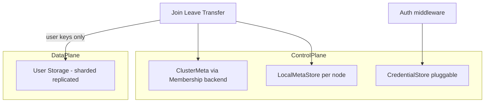
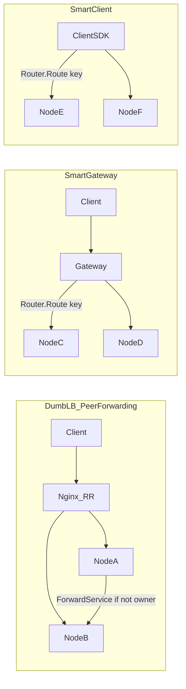
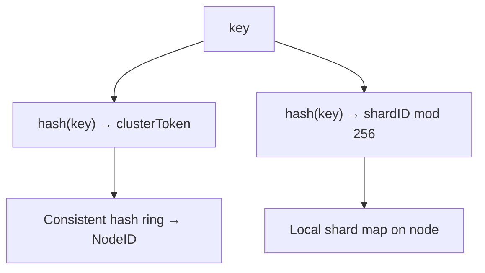
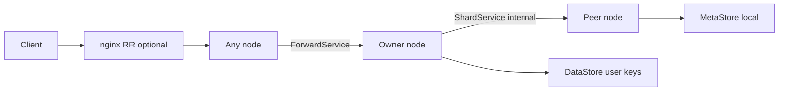

# Go Distributed KV Store Library — Project Prompt

## What I Am Building

A Go **library** (not an application) that provides composable, pluggable building blocks for
distributed key-value stores. Users wire together provided implementations or supply their own
via interfaces. Everything works out of the box but nothing is locked in.

See [USE_CASES.md](USE_CASES.md) for LLM agent integration patterns and access-pattern guidance.

This is a plugin-style architecture. For example:

- I provide an HTTP server/client transport and a gRPC server/client transport
- I provide an in-memory map (with RWMutex) and a bbolt storage backend
- I provide a consistent hash ring router, a static shard router, a passthrough router
- Users can swap any of these out by implementing the relevant interface
- The interfaces are intentionally minimal to ensure generalisation across backends

---

## Design Philosophy

- **Interface-driven** — core operations defined as minimal Go interfaces
- **Pluggable** — storage, transport, routing, replication, auth, meta storage all swappable independently
- **Composable** — single node, sharded node, multi-node cluster are different compositions of the same parts
- **Batteries included** — reference implementations for all common cases
- **Incremental** — simple single-node works first, complexity layered on top
- **No lock-in** — a user providing a Redis-backed storage only needs to implement Get, Put, Delete (and Scan where needed)
- **Learning-oriented** — where external libraries exist (bbolt, hashicorp/raft), the library also provides a from-scratch implementation so the internals are understood. Users choose which to use.
- **Data/control plane separation** — user KV data and operational metadata are stored and managed independently; scaling and shard redistribution never migrate control-plane state through the user-data transfer protocol

### Data plane vs control plane

| Plane | What it stores | Sharded? | Moved on redistribution? |
| ----- | -------------- | -------- | ------------------------ |
| **Data plane** | User keys/values via `Storage` | Yes (hash ring) | Yes — keys transfer node-to-node |
| **Control plane** | Cluster ops, transfer state, hints, credentials, node identity | No | No — meta stays local or in dedicated cluster backend |

**Invariant**: shard redistribution and cluster scaling must never require migrating control-plane state through the user-data transfer protocol. Transfer checkpoints, hints, and dedup caches live in meta stores, not in sharded user `Storage`.



---

## MVP Scope

The library MVP delivers composable distributed KV primitives. Use this table as a filter when reading the rest of the document — anything in the Deferred column is present for design completeness but not required to build.

| In MVP | Deferred (post-MVP) |
| ------ | ------------------- |
| gRPC internal transport + HTTP/gRPC client-facing | Coordinated cluster-wide Scan snapshot |
| Consistent hash ring + peer-to-peer forwarding hops | Merkle root verification during cutover |
| Static + in-memory dynamic membership | Hybrid Logical Clocks (HLC) |
| Shard transfer + join/leave/failure redistribution | Full RequestID exactly-once dedup (Phase 6) |
| Leaderless quorum replication (N/W/R) | JWT, OIDC, RoleStore, full RBAC |
| Static API key auth + TLS/mTLS on cluster (Phase 4c) | Gossip and Raft membership backends |
| `Entry` envelope + `codec/` for TTL and versioning | Distributed / cross-shard transactions |
| Single-node CAS optional (Phase 3) | Multi-key batch atomicity |
| LBConfigSync for scaling topology changes | Tracer interface + trace_id propagation |

---

## Deployment Topologies

Three first-class deployment modes, all composable from the same parts:



| Mode | Client entry point | Routing knowledge | When to use |
| ---- | ------------------ | ----------------- | ----------- |
| **Dumb LB + peer forwarding** | nginx/HAProxy round-robin | None on client or LB; any node may receive request | Simple ops, curl-friendly, minimal client logic |
| **Smart gateway** | Dedicated gateway tier | Gateway holds `Router` + `Membership` | Central auth, rate limits, no forwarding hops |
| **Smart client** | SDK with embedded `Router` | Client holds ring; talks directly to owner | Lowest latency, no gateway SPOF |

### Dumb LB + peer forwarding

- Storage nodes remain client-facing (existing `KVService` port)
- LB has **no hash-ring awareness** — round-robin only
- Nodes use `ForwardService` when they don't own the key
- **`LBConfigSync`** watches `Membership.Watch()` and emits updated upstream lists (nginx config snippet, HAProxy backend list, or K8s Endpoints patch). Pluggable sink interface:

```go
type LBConfigSink interface {
    Apply(ctx context.Context, backends []Backend) error
}
```

Reference sinks: file writer (nginx `upstream` block), stdout (for sidecar), noop. Pluggable sink pattern — operators can substitute HAProxy or K8s Endpoints adapters without changing the core library. MVP requires only file writer + noop.

**Redistribution is topology-independent** — key migration uses internal `ShardService` only. nginx/LB/`LBConfigSync` updates the backend pool; it never moves data. Wrong-node requests during redistribution: `Router` uses the current generation and forwards to the authoritative owner (source during transfer, destination after cutover).

**LB pool timing during transfer**:

| Node state | In nginx pool? | Receives client traffic? |
| ---------- | -------------- | ------------------------ |
| `Receiving` (not ready) | No | No — internal only |
| `Ready` / `Active` | Yes | Yes |
| `TransferringOut` | Yes (draining) | Yes, forwards owned keys; new writes go to successor |

### Smart gateway

- Gateway composes `Router`, `Membership`, `NodePool`, optional auth
- Storage nodes may run **internal port only** (no client-facing) in this mode
- Gateway exposes `KVService`; no `ForwardService` on the hot path

### Smart client

- Client SDK embeds `Router` and `NodePool`
- Talks directly to the owning node — no forwarding hop, no gateway tier

### Node roles

Every process has a role that determines which services bind to which ports:

```go
type NodeRole int // StorageOnly | ClientFacing | Gateway
```

| Role | Client-facing port | Internal port | Notes |
| ---- | ------------------ | ------------- | ----- |
| `ClientFacing` | `KVService` | cluster services | Default for dumb-LB mode |
| `StorageOnly` | none | cluster services | Used behind smart gateway |
| `Gateway` | `KVService` | optional (membership only) | No user `DataStore`; may use local `MetaStore` |

---

## Core Conventions (apply everywhere)

- **Value type is `[]byte`** throughout — transport-agnostic, users serialize on top
- **Every interface method accepts `context.Context` as first argument** — no exceptions
- **Error types are defined by the library** — callers distinguish errors by type, not string matching:
  - `ErrKeyNotFound`
  - `ErrThrottled`
  - `ErrNotOwner`
  - `ErrNodeUnavailable`
  - `ErrTransferInProgress`
  - `ErrUnauthorized`
  - `ErrForbidden`
  - `ErrInvalidArgument`
- **RequestID** — all mutating ops accept an optional `RequestID`. In MVP: propagated through the forward chain for logging and tracing; client retry policy retries `Unavailable` / `ResourceExhausted` only; no guarantee of exactly-once without replication. Post-MVP (Phase 6): `DedupStore` on replicas provides effectively-once on quorum writes.
- **Limits** — configurable max key size (default 1 KB), max value size (default 1 MB); violations return `ErrInvalidArgument`
- **Ports are configurable** — the library never hardcodes port numbers, always accepts config. Convention (not requirement): client-facing on one port, internal cluster on another.
- **slog for logging** — stdlib since Go 1.21, no external dependency. Every component accepts an optional `*slog.Logger`. If nil, a no-op logger is used.

---

## Package Structure

```
kvstore/
  storage/        — user data plane: Storage interface + implementations
  codec/          — Entry marshal/unmarshal (JSON in v1; swappable); shared by all backends
  meta/           — control-plane storage interfaces + reference implementations
    local/        — per-node MetaStore (in-memory, bbolt)
    cluster/      — adapters over Membership backends (static, gossip, etcd, raft)
  transport/      — TransportServer, TransportClient interfaces + HTTP/gRPC implementations
  cluster/        — NodePool, hash ring, shard map, membership, LBConfigSync
  replication/    — replication strategy interface + implementations
  node/           — composes storage, meta, transport, routing, replication; NodeRole config
  gateway/        — smart gateway composition
  client/         — cluster-aware Client facade
  security/       — Authenticator, Authorizer, TLS helpers
  proto/          — protobuf definitions for gRPC services
  observe/        — Metrics, Tracer, StateInspector, structured state types
  testing/        — mock implementations of all interfaces for use in user tests
```

---

## Interface Layers

### Storage (data plane)

User-facing key-value storage. Subject to sharding, replication, and redistribution.

```go
type Storage interface {
    Get(ctx context.Context, key string) ([]byte, error)
    Put(ctx context.Context, key string, value []byte) error
    Delete(ctx context.Context, key string) error
}

// Extended — required for shard transfer and rebalancing
type ScanStorage interface {
    Storage
    Scan(ctx context.Context, fn func(key string, value []byte) error) error
}

// Optional — for backends that support TTL natively
type TTLStorage interface {
    Storage
    PutWithTTL(ctx context.Context, key string, value []byte, ttl time.Duration) error
}

// Optional — for backends that support atomic operations
type CASStorage interface {
    Storage
    CompareAndSwap(ctx context.Context, key string, oldVal, newVal []byte) (bool, error)
}
```

Reference implementations:

- In-memory map with RWMutex (implements Storage + ScanStorage + TTLStorage + CASStorage)
- bbolt (implements Storage + ScanStorage + CASStorage) — uses bbolt's own durability
- Hand-rolled WAL-backed store (implements Storage + ScanStorage) — learning implementation, not dependent on bbolt

### Internal storage record: `Entry`

The public `Storage` API operates on `[]byte` values. Internally, every backend stores an `Entry` — a small envelope that adds expiry and versioning without exposing those details to callers.

```go
// Entry is the internal on-disk / in-memory record — not exposed on the public Storage API.
// Backends marshal/unmarshal Entry via the codec/ package.
type Entry struct {
    Value     []byte
    ExpiresAt int64  // Unix nanoseconds; 0 = no expiry
    Version   uint64 // Monotonic per-key counter; increments on every write and delete tombstone
}
```

`Entry` is a foundational type defined in Phase 1 alongside all other core types. Backends wire up to it in Phase 2.

**`Entry.ExpiresAt` and `TTLStorage`** — these coexist and serve different roles. `Entry.ExpiresAt` is the storage-layer representation of expiry embedded in every record. `TTLStorage.PutWithTTL` is a convenience API: it converts a `time.Duration` into `Entry.ExpiresAt` before writing — not a separate mechanism. Backends that support engine-native expiry scheduling (e.g. a background sweeper) can honour `ExpiresAt` natively; others check it on read and return `ErrKeyNotFound` for expired entries. The `TTLStorage` interface signals native engine support; it is not made redundant by `Entry.ExpiresAt`.

### API Hierarchy

```
Storage.Get / Put / Delete          — MVP (Phase 1)
CASStorage.CompareAndSwap           — MVP optional, single-node (Phase 3)
ScanStorage.Scan                    — required for shard transfer (Phase 2)
TTLStorage.PutWithTTL               — convenience wrapper over Entry.ExpiresAt (Phase 2)
Batch (atomic multi-key, one node)  — post-MVP
Transaction (single-node ACID)      — post-MVP
Distributed transaction             — out of scope v1
```

Encryption at rest is backend-dependent and out of scope for the library core — users configure it on their chosen storage backend if supported.

### Control Plane Storage

Operational metadata — cluster management, transfer state, auth credentials, node identity. **Not** sharded, **not** routed through the hash ring, **not** transferred during redistribution.

#### Base interface: `MetaStore`

Local, per-node control-plane persistence. Separate interface from user `Storage` — different lifecycle and key namespace.

```go
type MetaStore interface {
    Get(ctx context.Context, key string) ([]byte, error)
    Put(ctx context.Context, key string, value []byte) error
    Delete(ctx context.Context, key string) error
    Scan(ctx context.Context, prefix string, fn func(key string, value []byte) error) error
}
```

Reference implementations: in-memory map (testing/dev), bbolt file per node (`meta.db` alongside user data dir).

Serialization: library defines typed structs; meta store holds encoded bytes (JSON in v1 for debuggability).

#### Domain-specific pluggable stores

Each concern gets its own small interface. All accept a `MetaStore` backend (or cluster backend) via constructor — user can swap map/bbolt without changing business logic.

**`TransferStore`** (local, per-node) — in-flight redistribution state:

```go
type TransferStore interface {
    SaveCheckpoint(ctx context.Context, transferID string, cp TransferCheckpoint) error
    GetCheckpoint(ctx context.Context, transferID string) (TransferCheckpoint, error)
    SaveTransferState(ctx context.Context, shardRange RangeToken, state TransferState) error
    ListActiveTransfers(ctx context.Context) ([]TransferState, error)
    DeleteTransfer(ctx context.Context, transferID string) error
}
```

Keys under prefix `transfer/`. Survives process restart; not sharded.

**`HintStore`** (local, per-node) — hinted handoff write-ahead buffer. Stores writes destined for temporarily unavailable replica nodes; delivered on node recovery. Reference impl persists in local `MetaStore` under prefix `hints/`. Not user data.

```go
type HintStore interface {
    PutHint(ctx context.Context, key string, targetNode string) error
    GetHints(ctx context.Context, nodeID string) ([]Hint, error)
}
```

**`DedupStore`** (local, per-node) — idempotency cache for `RequestID` dedup:

```go
type DedupStore interface {
    Seen(ctx context.Context, requestID string) (bool, error)
    Mark(ctx context.Context, requestID string, ttl time.Duration) error
}
```

In-memory with optional bbolt backing; TTL eviction required. Prefix `dedup/`.

**`NodeStore`** (local, per-node) — node identity and local operational config:

```go
type NodeStore interface {
    NodeID(ctx context.Context) (string, error)
    SetNodeID(ctx context.Context, id string) error
    LocalConfig(ctx context.Context) (NodeLocalConfig, error)
}

// NodeLocalConfig holds per-node operational parameters written at bootstrap.
type NodeLocalConfig struct {
    ClientAddr   string   // address this node advertises for client-facing traffic
    InternalAddr string   // address for cluster-internal gRPC
    Role         NodeRole
}
```

Prefix `node/`. Written once at bootstrap. Cluster membership is `Membership`, not `NodeStore`.

**`CredentialStore`** (pluggable — local or external) — auth credentials:

```go
type CredentialStore interface {
    ValidateAPIKey(ctx context.Context, keyHash []byte) (Principal, error)
    ListKeys(ctx context.Context) ([]CredentialRecord, error)
    PutKey(ctx context.Context, record CredentialRecord) error
    RevokeKey(ctx context.Context, keyID string) error
}
```

Reference: bbolt-backed `CredentialStore` under prefix `auth/`. Alternative: `ExternalCredentialStore` wrapping JWKS/OIDC — validate-only, no local user DB. Static API key + bbolt `CredentialStore` are delivered in Phase 4c; full RBAC via optional `RoleStore` in Phase 7.

#### Three tiers of state

Every piece of data in the system belongs to one of three tiers. Getting this wrong — especially putting cluster coordination state in the user data plane — causes circular dependencies that are very hard to untangle.

| Tier | Store | Consistency | Example data |
| ---- | ----- | ----------- | ------------ |
| **User data** | `Storage` (sharded, hash ring) | Per-key owner / quorum | User keys and values |
| **Local control** | `MetaStore` (per-node, not sharded) | Local durability only | Transfer checkpoints, hints, dedup cache, credentials |
| **Cluster coordination** | `Membership` backend | Strongly consistent | Node registry, liveness, ring generation tokens |

#### Why cluster coordination needs a separate backend

Cluster membership **cannot** live in the same sharded user KV this library is building. The problem is circular: to route a request you need to know which nodes exist, but to know which nodes exist you need to talk to the cluster — which requires routing. The solution is a coordination backend that is completely independent of the data plane.

- **Phase 1–4 (MVP, static):** a static config file is the `Membership` implementation — no external dependency. Nodes are listed in config; operator restarts to change membership.
- **Phase 5 (dynamic, production):** etcd-backed `Membership` is the reference implementation. etcd's watch/lease API provides the event stream that drives `MembershipEvent` — the same events that trigger ring recalculation, `LBConfigSync`, and shard redistribution. etcd is purpose-built for this pattern and avoids the need to bootstrap consensus inside the data plane itself.
- **Phase 7 (learning path):** Raft-backed membership via `RaftService` proto — understand how etcd-like consensus works from first principles.

The `Membership` interface abstracts over all of these. Adapters satisfy it by wrapping a `CoordinationStore`:

```go
// CoordinationStore is a design sketch — not a required MVP interface.
// It shows the minimal contract that static config, etcd, and Raft all satisfy,
// which is why Membership adapters can wrap any of them interchangeably.
type CoordinationStore interface {
    Get(ctx context.Context, key string) ([]byte, error)
    Put(ctx context.Context, key string, value []byte) error
    Watch(ctx context.Context, prefix string) (<-chan Event, error)
}
```

#### Cluster-wide meta (via `Membership`)

Cluster-scoped records are owned by the `Membership` backend — do not duplicate them in `MetaStore`:

| Record | Owner |
| ------ | ----- |
| Node registry, liveness | `Membership` |
| Ring generation token | `Membership` / `Router` (derived from membership events) |
| Global cluster config | `Membership` or static config file |

`ClusterState` from observability is a **read snapshot** assembled from `Membership` + local `TransferStore` + user `Storage` stats — not a persisted blob.

#### Meta key namespace

| Prefix | Store | Scope | Examples |
| ------ | ----- | ----- | -------- |
| `node/` | `NodeStore` | local | node ID, local ports, role |
| `transfer/` | `TransferStore` | local | checkpoints, active transfer state |
| `hints/` | `HintStore` | local | hinted handoff queue |
| `dedup/` | `DedupStore` | local | recent RequestIDs |
| `auth/` | `CredentialStore` | local or external | API key hashes, revocation |
| *(user keys)* | `Storage` | sharded | **never** mixed with above |

#### NodeConfig wiring

```go
type NodeConfig struct {
    Role            NodeRole
    Logger          *slog.Logger
    DataStore       Storage           // user data plane — sharded
    MetaStore       MetaStore         // local control plane — NOT sharded
    TransferStore   TransferStore     // optional; default wraps MetaStore
    HintStore       HintStore
    DedupStore      DedupStore
    NodeStore       NodeStore
    CredentialStore CredentialStore   // optional
    Membership      Membership        // cluster control plane
    // ...
}
```

Gateway role: `DataStore` nil; still uses `MetaStore` (in-memory) for auth cache and routing epoch; `CredentialStore` if centralizing auth.

### Transport (Client-Facing)

```go
type TransportServer interface {
    Serve(ctx context.Context, handler RequestHandler) error
    Shutdown(ctx context.Context) error
}

type TransportClient interface {
    Get(ctx context.Context, addr string, key string) ([]byte, error)
    Put(ctx context.Context, addr string, key string, value []byte) error
    Delete(ctx context.Context, addr string, key string) error
}
```

Reference implementations: HTTP, gRPC. HTTP is valid for client-facing — easy to test with curl, good for CLIs.

`TransportClient` is low-level (address per call) — used by gateway and internal components. Application code should use the cluster-aware `Client` interface instead.

### Cluster Transport (Internal Node-to-Node)

- **gRPC only** — HTTP is not suitable for internal traffic
- Reasons: native streaming for shard transfer, HTTP/2 multiplexing, typed protobuf contracts, bidirectional streaming for replication and gossip
- Users could theoretically swap but there is little practical reason to

### Security

Pluggable authentication and authorization. Auth runs **before** routing and replication.

**Phase delivery:**

| Item | Phase |
| ---- | ----- |
| `Authenticator`/`Authorizer` interfaces + noop | Phase 1 |
| Static API key via `CredentialStore` (bbolt) | Phase 4c |
| TLS on client-facing gRPC/HTTP | Phase 4c |
| mTLS on internal cluster gRPC | Phase 4c |
| JWT / OIDC via `ExternalCredentialStore` | Phase 7 |
| `RoleStore` / full RBAC | Phase 7 |

mTLS on internal cluster gRPC is **recommended from first multi-node deployment** (Phase 4c). It is not an advanced feature — running an unencrypted cluster network is a security risk from the moment nodes communicate. The library wires TLS via `*tls.Config`; cert provisioning is the operator's responsibility.

```go
type Principal interface {
    ID() string
    // opaque claims/metadata
}

type Authenticator interface {
    Authenticate(ctx context.Context, token []byte) (Principal, error)
}

type Authorizer interface {
    Authorize(ctx context.Context, p Principal, op string, key string) error
}
```

Wire points:

- gRPC: unary + stream interceptors on `TransportServer` and gateway
- HTTP: middleware wrapper around `RequestHandler`
- Internal cluster: mTLS-as-identity (`Principal` derived from client cert CN/SAN) — Phase 4c

Reference implementations: **noop** (Phase 1 default), **static API key** via `CredentialStore` (Phase 4c), **JWT** via `ExternalCredentialStore` (Phase 7).

`Authenticator`/`Authorizer` consume `CredentialStore` when configured; noop when not.

Gateway mode is the natural place for centralized auth. In dumb-LB mode, each node runs the same `Authenticator`/`Authorizer` chain.

TLS configuration:

```go
type TLSConfig struct {
    Config *tls.Config // user-provided; library never generates certs
}
```

Accepted by all servers and `NodePool` dial options:

- Server TLS (client-facing) — Phase 4c
- mTLS (internal cluster — recommended default, Phase 4c)
- Cert rotation is user responsibility; library accepts `*tls.Config`

### Routing

```go
type Router interface {
    // returns the node address responsible for this key
    Route(key string) (addr string, err error)
}
```

Reference implementations: passthrough (single node), consistent hash ring, static shard map (predefined key-range → node map at cluster level).

### Consistency & Conflict Resolution

The `Membership` interface is fully pluggable, but each backend carries different consistency guarantees. Choose topology and replication together — they are not independent drop-ins.

| Topology | Replication | Caller guarantee | Conflict resolution |
| -------- | ----------- | ---------------- | ------------------- |
| Single node, no replication | none | linearizable (single writer) | n/a |
| Sharded, no replication | none | per-key owner is authoritative | n/a |
| Leaderless quorum | N/W/R | tunable: `R+W > N` → read-your-writes possible | **LWW** via `(wall_clock_time, node_id)` — HLC deferred to post-MVP |
| Leader-based (Raft) | per-shard leader | linearizable per shard | Raft log ordering |

> **Static membership footnote:** when using the static `Membership` implementation (MVP default), split-brain requires manual operator intervention — edit the config and restart affected nodes. Automatic split-brain detection requires a dynamic membership backend (Phase 5+).

Shared write descriptor used by replication and transfer:

```go
// OpType identifies the kind of write operation.
type OpType int

const (
    OpPut    OpType = iota
    OpDelete
)

// Operation is the unit of replication and shard transfer — carries a write across the network.
// Distinct from Entry: Operation is the network/log envelope; Entry is the storage-layer record.
type Operation struct {
    Type      OpType
    Key       string
    Value     []byte // nil for Delete
    Version   Version
    RequestID string // propagated for logging and tracing; exactly-once dedup requires Phase 6
}

// Version is the replication ordering key for LWW conflict resolution across replicas.
// Distinct from Entry.Version (monotonic uint64 per-key counter used for CAS at the storage layer).
type Version struct {
    Timestamp time.Time // wall-clock time at write origin; HLC upgrade is post-MVP
    NodeID    string
}
```

**Version semantics:**
- `Entry.Version` (uint64) — per-key monotonic counter incremented on every write at the storage layer. Used by `CASStorage` to compare-and-swap without reading the value.
- `Operation.Version` (Timestamp + NodeID) — write descriptor populated by the node that accepts the write. Used by replication for LWW ordering across replicas. These two versions are distinct and serve different purposes; do not conflate them.

Split-brain handling depends on membership backend:

- **Static config** — manual operator intervention
- **Gossip** — version vectors detect divergence
- **Raft** — prevented by consensus protocol

`ErrNotOwner` is returned only when forwarding is disabled or hop limit is exceeded — not to external clients in dumb-LB or gateway modes (requests are forwarded or routed transparently).

### Replication

```go
type Replicator interface {
    Write(ctx context.Context, op Operation) error        // quorum write
    Read(ctx context.Context, key string) ([]byte, error) // quorum read
}

```

Reference implementations: leaderless quorum, leader-based. Configurable N (replicas), W (write quorum), R (read quorum).

- **Hinted handoff** — when a replica node is temporarily unavailable, writes are stored as hints in local `MetaStore` (`hints/` prefix) via `HintStore` (defined in Control Plane Storage above) and delivered on recovery
- **Read repair** — stale reads trigger background repair to the latest version
- **Idempotency** — replicas deduplicate by `RequestID` via `DedupStore` (Phase 6; not required for MVP single-node path)

### Cluster Membership

```go
type Membership interface {
    Members() []NodeInfo
    Join(ctx context.Context, node NodeInfo) error
    Leave(ctx context.Context, nodeID string) error
    Watch(ctx context.Context, fn func(event MembershipEvent)) error
}

// MembershipEvent is fired by Watch whenever cluster topology changes.
// Subscribers (Router, LBConfigSync, ShardService) react to these events.
type MembershipEvent struct {
    Type NodeEventType // Join, Leave, Fail
    Node NodeInfo
}

type NodeEventType int

const (
    NodeJoined NodeEventType = iota
    NodeLeft
    NodeFailed
)
```

Reference implementations:
- **static config** — MVP default; no external dependency; no dynamic events (operators edit config and restart)
- **in-memory dynamic** — no external dependency; fires `MembershipEvent` on `Join`/`Leave` calls; used for Phase 5 integration testing without etcd
- **etcd-backed** — Phase 5 production reference; watch/lease API drives events reliably
- **gossip / raft-backed** — Phase 7 learning paths

Each backend is a valid `Membership` implementation, but operators must understand the consistency trade-offs documented in the matrix above.

### NodePool

Persistent connections to peer nodes. Referenced throughout cluster operations but defined here:

```go
type NodePool interface {
    Get(ctx context.Context, addr string) (NodeConn, error)
    Close() error
}

type NodeConn interface {
    Get(ctx context.Context, key string) ([]byte, error)
    Put(ctx context.Context, key string, value []byte) error
    Delete(ctx context.Context, key string) error
    Forward(ctx context.Context, req ForwardRequest) (ForwardResponse, error)
    Addr() string
}
```

Rules:

- One persistent gRPC connection per peer, created at startup, reused for all RPCs
- Keepalive config must match on both client and server sides
- Optional circuit breaker wrapper for `ErrNodeUnavailable` backoff

### Client API

Cluster-aware client — hides address routing from application code:

```go
type Client interface {
    Get(ctx context.Context, key string) ([]byte, error)
    Put(ctx context.Context, key string, value []byte) error
    Delete(ctx context.Context, key string) error
    Scan(ctx context.Context, opts ScanOptions) (ScanIterator, error)
}

type ClientConfig struct {
    Router    Router        // required for smart client mode
    Transport TransportClient
    Pool      NodePool
    Retry     RetryPolicy   // pluggable; default: retry Unavailable, ResourceExhausted
    Auth      Authenticator // optional; attaches credentials to outbound calls
}
```

**Scan semantics**:

- **Single-node**: local `ScanStorage.Scan`
- **Dumb-LB / smart gateway / smart client**: fan out to all nodes, merge streams; supports `ScanOptions{Prefix, Limit, Cursor}`
- **Consistency**: best-effort point-in-time — not a coordinated snapshot unless a future phase adds one

---

## Observability — First-Class Concern

Observability covers four things: metrics, logging, tracing, and state inspection. Metrics tell you something is wrong, logging tells you what happened, tracing shows you the request path, state inspection tells you the current condition of any component.

### Logging

Structured fields on every log entry: `node_id`, `shard_id`, `operation`, `key` (hashed, not raw), `duration_ms`, `request_id`, `trace_id`, `error`.

### Metrics

```go
// Optional interface — users provide their own implementation
// e.g. backed by Prometheus, OpenTelemetry, or a simple in-memory counter
type Metrics interface {
    RecordOperation(op string, duration time.Duration, err error)
    RecordShardSize(shardID uint32, keys int)
    RecordTokenBucket(shardID uint32, tokens float64)
    RecordReplication(success bool, duration time.Duration)
    RecordTransfer(shardID uint32, keys int, duration time.Duration)
}
```

Not coupled to any specific metrics library. User wires in Prometheus, OpenTelemetry, or anything else.

### Tracing

Optional interface — users provide their own implementation (OpenTelemetry, etc.):

```go
type Tracer interface {
    StartSpan(ctx context.Context, name string) (context.Context, Span)
}
```

Propagate `request_id` and trace context via gRPC metadata and HTTP headers on every hop (client → gateway/node → forward → replica).

### State Inspection

Every major component exposes a `State()` method returning a structured, serialisable snapshot. `StateInspector` reads from meta stores where relevant (`TransferState`, `PendingHints`, active transfers).

```go
// Node-level state
type NodeState struct {
    ID             string
    Addr           string
    Status         NodeStatus // Active, Receiving, Transferring, TransferringOut
    ShardCount     int
    Shards         []ShardState
    PeerCount      int
    Peers          []PeerState
    ReplicationLag time.Duration
    PendingHints   int
    ActiveTransfers []TransferState
}

// Per-shard state
type ShardState struct {
    ID            uint32
    KeyCount      int
    Tokens        float64       // current token bucket level
    Status        ShardStatus   // Active, Transferring, Receiving
    OwnerNode     string
    TransferState TransferState // phase, keys transferred, checkpoint version
}

// Cluster-level state — assembled snapshot, not persisted
type ClusterState struct {
    Nodes       []NodeState
    TotalKeys   int
    TotalShards int
    RingHash    uint32 // fingerprint of current ring config
}

// User data plane state
type StorageState struct {
    Implementation string
    KeyCount       int
    SizeBytes      int64
    ShardStates    []ShardState
}

// Control plane state
type MetaStoreState struct {
    Implementation string
    SizeBytes      int64
    KeyCounts      map[string]int // by prefix: node/, transfer/, hints/, dedup/, auth/
}
```

These are exposed via:

- A `StateInspector` interface any component can implement
- An optional HTTP debug endpoint (e.g. `/debug/state`) on the client-facing server — returns separate `StorageState` and `MetaStoreState` sections
- Loggable on demand via slog

```go
type StateInspector interface {
    State(ctx context.Context) (any, error)
}
```

### Lifecycle

Graceful shutdown sequence:

1. Stop accepting new requests
2. Drain in-flight requests (configurable timeout)
3. Complete or abort active transfers (`TransferStore`)
4. Leave cluster (`Membership.Leave`)
5. Shutdown transport (`TransportServer.Shutdown`)

---

## gRPC Service Definitions

### Client-Facing (configurable port, default convention)

Bound on `ClientFacing` and `Gateway` roles only.

```protobuf
service KVService {
    rpc Get(GetRequest) returns (GetResponse);
    rpc Put(PutRequest) returns (PutResponse);
    rpc Delete(DeleteRequest) returns (DeleteResponse);
    rpc Scan(ScanRequest) returns (stream ScanResponse);
}
```

### Internal Cluster (separate configurable port)

Bound on all node roles except pure gateway (gateway may bind for membership RPCs only).

```protobuf
// Request forwarding — when a node receives a request it doesn't own
// Kept separate from KVService to carry forwarding metadata (hop count, origin node)
// x-forwarded metadata prevents infinite forwarding loops
// Not used on smart gateway hot path
service ForwardService {
    rpc Forward(ForwardRequest) returns (ForwardResponse);
}

// ForwardRequest carries the original client operation plus hop metadata.
message ForwardRequest {
    string origin_node_id = 1; // the node that first received the client request
    int32  hop_count      = 2; // incremented on each forward; request dropped if > max_hops
    string key            = 3;
    bytes  value          = 4; // empty for Get/Delete
    string op_type        = 5; // "get", "put", "delete"
    string request_id     = 6;
}

message ForwardResponse {
    bytes  value = 1; // populated for Get
    string error = 2; // error code string; empty = success
}

// Write propagation to replicas
service ReplicationService {
    rpc Replicate(ReplicateRequest) returns (ReplicateResponse);
    rpc ReplicateStream(stream ReplicateRequest) returns (ReplicateResponse);
}

// Shard ownership and transfer — user keys only; control-plane state stays in MetaStore
service ShardService {
    rpc TransferShard(stream ShardChunk) returns (TransferResponse);
    rpc ShardInfo(ShardInfoRequest) returns (ShardInfoResponse);
}

// Cluster membership and liveness
service ClusterService {
    rpc Heartbeat(HeartbeatRequest) returns (HeartbeatResponse);
    rpc Join(JoinRequest) returns (JoinResponse);
    rpc Leave(LeaveRequest) returns (LeaveResponse);
    rpc ClusterState(ClusterStateRequest) returns (ClusterStateResponse);
}

// Leader election
// Two paths:
// (a) Hand-rolled implementation using this proto — for learning
// (b) Delegate entirely to hashicorp/raft which owns its own transport — for production
service RaftService {
    rpc RequestVote(VoteRequest) returns (VoteResponse);
    rpc AppendEntries(AppendRequest) returns (AppendResponse);
}
```

---

## Node Architecture

Node behavior depends on `NodeRole`:

| Role | Servers | Clients | Storage |
| ---- | ------- | ------- | ------- |
| `ClientFacing` | gRPC on client-facing + internal ports | `NodePool` to all peers | `DataStore` + local `MetaStore` |
| `StorageOnly` | gRPC on internal port only | `NodePool` to all peers | `DataStore` + local `MetaStore` |
| `Gateway` | gRPC on client-facing port | `NodePool` to all storage nodes | local `MetaStore` only (no `DataStore`) |

Connection rules:

- One persistent connection per peer, created at startup, reused for all RPCs
- Never open/close connections per request
- gRPC handles reconnection automatically on transport failure — just retry the RPC
- Keepalive config must match on both client and server sides or connections drop silently
- Retryable error codes: `Unavailable`, `ResourceExhausted` — never retry `NotFound`, `InvalidArgument`

---

## Sharding Architecture

Two independent levels with distinct responsibilities:



**Cluster level** — consistent hash ring maps keys to owning nodes

- Virtual nodes (100-200 per physical node) smooth uneven distribution
- Adding/removing a node only remaps keys in the affected range
- `static shard router` is an alternative cluster-level router (predefined key-range → node map), not the node-level 256-shard map

**Node level** — each node maintains a local shard map (~256 shards)

- Local concurrency partition only — not independently movable across nodes
- Each shard has its own RWMutex — concurrent ops on different key ranges don't block each other
- Each shard has its own token bucket for burst capacity
- Powers of 2 for shard count makes modulo a cheap bitwise op
- Cluster transfer moves keys by token range, not by local shard ID

**Ownership source of truth**: `Membership` + `Router` generation number. Nodes reject writes for stale generations (`ErrTransferInProgress`).

Key lookup path:

```
key → hash → clusterToken → NodeID (via ring)
key → hash → shardID (mod 256, local concurrency partition)
```

---

## Cluster Redistribution

Redistribution moves **user keys only** via internal `ShardService`. Control-plane state (checkpoints, hints, dedup cache, credentials) stays in local `MetaStore` or `Membership` — never streamed through `TransferShard`. Applies equally to dumb LB, gateway, and smart client topologies.



### Join

When a new node D joins and claims range(s) currently owned by predecessor(s) A, B, C:

1. D announces `StateReceiving` to the cluster (`Membership` assigns a generation token)
2. Each predecessor identifies keys in D's range by scanning local `DataStore`
3. Each range transfer is independent — own `transferID` in `TransferStore`
4. Predecessor streams keys to D via `TransferShard` (streaming gRPC)
5. During transfer: **writes go to both predecessor and D**, reads go to predecessor only
6. Per-shard sequence numbers tracked in `TransferStore`, not user `DataStore`
7. Cutover criteria met (see below) — D announces `StateReady`
8. Cluster switches: all reads and writes now go to D
9. Predecessors delete their copy of transferred keys
10. `LBConfigSync` adds D to nginx pool only after `StateReady`

The double-write window ensures writes during transfer are not lost.

#### Cutover criteria

D is ready when both of the following hold:

1. Bulk `TransferShard` stream completes with a `TransferCheckpoint` persisted in `TransferStore` (last key + version)
2. D has applied all double-writes since checkpoint (tracked via per-shard sequence number in `TransferStore`)

> Post-MVP: optional Merkle root comparison between D's range and the predecessor's as an integrity check (Dynamo-style). Non-trivial to implement; deferred.

### Leave

Graceful leave before removal from LB pool:

1. Node L marks ranges as `TransferringOut` in `TransferStore`
2. For each range: stream to successor(s) — same protocol as join, reversed
3. L drains in-flight client requests
4. `Membership.Leave` → ring generation bump
5. `LBConfigSync` removes L from upstream **after** transfers complete

### Failure

- Heartbeat timeout via `ClusterService`
- `Membership` marks node dead; successors initiate transfer from last known checkpoint in `TransferStore`
- If replication enabled: prefer replica as source
- Failed node removed from nginx pool; surviving nodes absorb ranges

### Failure recovery

| Failure | Behavior |
| ------- | -------- |
| D crashes mid-transfer | Predecessor continues serving; transfer restarts from checkpoint in `TransferStore` |
| Predecessor crashes mid-transfer | D discards partial state; new owner re-transfers |
| Concurrent join on same range | `Membership` serializes via generation token; second join rejected |
| Write during transfer | Double-write to predecessor + D; sequence numbers in `TransferStore` ensure ordering |

`TransferState` on `ShardState` and `ActiveTransfers` on `NodeState` expose phase, keys transferred, and checkpoint version for observability.

Forwarded requests carry an `x-forwarded` metadata flag to prevent infinite forwarding loops.

---

## Spike Handling vs Node Autoscaling

Node autoscaling is **not** suitable for traffic spikes:

- DynamoDB's own docs state autoscaling only triggers after 2+ minutes of sustained high load
- Total end-to-end latency from spike to new capacity is ~3-5 minutes
- By then the spike is over

Correct tools for spikes (all in-process, zero latency):

**Token bucket per shard** — accumulates up to 5 minutes of unused capacity (DynamoDB's burst capacity model). During a spike, stored tokens absorb the load without throttling.

**Adaptive capacity** — hot shards can borrow from a global node-level token pool when their own bucket is exhausted, provided total node capacity is not exceeded.

**Node autoscaling** is for **sustained growth** only — dataset outgrows memory, weeks of elevated traffic, capacity planning.

| Spike duration | Right tool |
| -------------- | ---------- |
| Seconds | Per-shard token bucket |
| Minutes | Adaptive capacity (global pool) |
| Hours+ | Add nodes (planned, off-peak) |

---

## Incremental Build Plan


### Phase 1 — Foundation

- Define core interfaces: `Storage`, `TransportServer`, `TransportClient`
- Define all core error types (including `ErrUnauthorized`, `ErrForbidden`, `ErrInvalidArgument`)
- Define all core types: `Entry`, `OpType`, `Operation`, `Version`, `MembershipEvent`, `NodeLocalConfig`
- `codec/` package: `Entry` marshal/unmarshal (JSON v1)
- `MetaStore` interface; in-memory reference; `NodeStore`
- In-memory map storage implementation (user data plane) — stores `Entry` bytes via `codec/`
- HTTP transport implementation
- Single node, no distribution, works end to end
- `slog` logging wired into every component from day one
- `StorageState`, `MetaStoreState`, and `NodeState` structs + `State()` methods on all components
- Noop `Authenticator` / `Authorizer` (auth hooks present, no enforcement)
- `testing/` package: mock Storage, mock TransportClient, mock MetaStore

### Phase 2 — Persistence (two paths, user chooses)

- **Path A — bbolt**: bbolt storage implementation for user `DataStore`; separate bbolt `MetaStore` reference (`meta.db`); both persist `Entry` bytes via `codec/`
- **Path B — hand-rolled WAL**: implement append-only WAL log, recovery on startup, compaction — learning implementation; also persists `Entry` bytes
- `Scan` added to storage interface (required by both paths)
- `TTLStorage` on both paths — `PutWithTTL` converts `time.Duration` → `Entry.ExpiresAt`; expiry checked on read
- `StorageState.SizeBytes` and `MetaStoreState.SizeBytes` populated

### Phase 3 — Node-level Sharding

- Shard map within a single node (~256 shards)
- Per-shard RWMutex
- Per-shard token bucket (burst capacity)
- Global node-level token pool (adaptive capacity)
- `Router` interface introduced (passthrough initially)
- `ShardState` fully populated, token bucket level observable via state
- `Metrics` interface introduced, wired into shard operations
- `CASStorage` reference implementations (in-memory map + bbolt) — single-node CAS straightforward with per-shard RWMutex

### Phase 4 — Static Multi-Node

- gRPC transport implementation
- `NodePool` interface and persistent connections to peers
- Static cluster config; static `Membership` implementation
- Consistent hash ring router
- Request forwarding (`ForwardService`) when node doesn't own a key
- Dumb-LB + peer forwarding documented as default multi-node topology
- `KVService` and `ForwardService` protos (with `ForwardRequest`/`ForwardResponse`)
- `PeerState` populated in `NodeState`
- Optional `/debug/state` HTTP endpoint on client-facing server
- `NodeRole` config (`ClientFacing`, `StorageOnly`, `Gateway`)

### Phase 4b — Client & LB Config

- `client/` facade (`Client` interface, `ClientConfig`, retry policy)
- `LBConfigSync` watches membership, emits backend list
- Reference `LBConfigSink`: file writer (nginx upstream block), stdout, noop

### Phase 4c — Auth, TLS, mTLS

- `CredentialStore` bbolt reference implementation (prefix `auth/`)
- Static API key `Authenticator` enforced on gRPC interceptors and HTTP middleware
- TLS on client-facing gRPC and HTTP servers
- mTLS on internal cluster gRPC (`NodePool` dial options + server config) — **recommended default, not optional**
- `security/` package: TLS helpers, `CredentialStore` wiring

### Phase 5 — Dynamic Cluster

- Node join/leave/failure redistribution protocol
- `TransferStore`; checkpoints and sequence numbers in meta, not user `Storage`
- Shard transfer streaming (`ShardService`) — user keys only
- Double-write window during transfers
- Multi-source join (independent `transferID` per range)
- Membership generation tokens (serialize concurrent joins)
- `ClusterService` proto
- `ClusterState` fully observable — assembled from `Membership` + `TransferStore` + `Storage`
- Transfer progress logged and exposed via state inspection (`TransferState`, `ActiveTransfers`)
- Dumb LB pool timing: node enters nginx pool only after `StateReady`
- **In-memory dynamic `Membership`** — fires `MembershipEvent` on `Join`/`Leave`; no external dependency; used for integration testing without etcd
- **etcd-backed `Membership`** — production reference; watch/lease API drives ring recalculation, `LBConfigSync`, redistribution

### Phase 5b — Smart Gateway

- `gateway/` package composing `Router`, `Membership`, `NodePool`, auth hooks
- Smart gateway topology — routes directly to owner, no `ForwardService` on hot path
- `StorageOnly` node role for backend nodes behind gateway

### Phase 6 — Replication

- `ReplicationService` proto
- `Operation` / `Version` types wired through write path
- Leaderless quorum implementation
- Configurable N, R, W
- bbolt-backed `HintStore`; `DedupStore` with TTL (exactly-once dedup on replicas)
- Read repair
- Idempotency via `RequestID` dedup on replicas (`DedupStore`)
- Replication lag and pending hints observable via `NodeState`

### Phase 7 — Advanced (two paths per item, user chooses)

- **Gossip membership**:
  - Path A: hand-rolled gossip protocol (learning)
  - Path B: existing gossip library
- **Raft consensus**:
  - Path A: hand-rolled Raft using `RaftService` proto (learning)
  - Path B: `hashicorp/raft` which owns its own transport (production)
- Adaptive capacity at cluster level (borrow across nodes, not just within a node)
- Leader-based replication
- JWT / OIDC via `ExternalCredentialStore`; optional `RoleStore` / RBAC
- `Tracer` interface + trace_id propagation via gRPC metadata and HTTP headers
- Merkle root cutover verification (optional integrity check, post-MVP)
- HLC timestamps on `Operation.Version` (upgrade from wall-clock)

---

## gRPC Services by Phase

| Phase | Services | Binding notes |
| ----- | -------- | ------------- |
| Phase 4 | `KVService`, `ForwardService` | `KVService` on ClientFacing + Gateway; `ForwardService` on ClientFacing only |
| Phase 4b | (no new services) | Client uses existing `KVService` |
| Phase 4c | (no new services) | Adds TLS/mTLS to existing gRPC servers and `NodePool` |
| Phase 5 | + `ShardService`, `ClusterService` | Internal port on all storage nodes; `ShardService` moves user keys only |
| Phase 5b | (no new services) | Gateway binds `KVService` only |
| Phase 6 | + `ReplicationService` | Internal port |
| Phase 7 | + `RaftService` (or delegate to hashicorp/raft) | Internal port |

---

## CLI Client Pattern

For any CLI tooling built on top of the library:

- Use the `client/` facade — not raw `TransportClient`
- One connection per process invocation (not per request)
- Always set `context.WithTimeout` — never hang on a dead server
- Use `os.Exit(1)` on errors for script composability
- Config priority: flag > env var > config file (kubectl/redis-cli pattern)
- No keepalives needed — connection is too short-lived to matter
- If adding a REPL/shell mode: dial once on shell start, reuse for all commands

---

## Open Design Questions

- Extension mechanism for users who need richer APIs than the base interface provides — e.g. a Redis adapter that wants to expose INCR or EXPIRE
- How to expose `ClusterState` to external operators — HTTP endpoint, gRPC reflection, both?
- Backup/export format — future phase; note control-plane `meta.db` should be backed up separately from user data
- Multi-gateway `CredentialStore` — external IdP or shared store recommended; single-gateway can use local bbolt
- **Scan semantics in multi-node context** — MVP uses parallel fan-out to all nodes with best-effort merge. Alternatives: coordinator-routed range scan, range-partitioned routing. Fan-out is simple but produces non-coordinated snapshots; alternatives require more infrastructure.
- **Batch API** — whether `Batch` (atomic multi-key, single node) becomes a first-class `Client` API or stays a backend-specific implementation detail. Single-node Batch does not require distributed coordination.

---

## Out of Scope (v1)

- Encryption at rest (backend-dependent; see Storage section)
- Backup/restore tooling
- Coordinated snapshot Scan across cluster
- Full RBAC user management UI
- Replicating local meta stores between nodes (each node owns its own `meta.db`)
- Storing user KV in meta store (strict namespace separation enforced by convention)
- Cross-shard / distributed transactions
- Coordinated multi-key atomicity across nodes (Batch scoped to single node only)

---

## Post-MVP Backlog

Items below are deferred — design is acknowledged, implementation is not in scope for the library MVP.

| Item | Why deferred | Target phase |
| ---- | ------------ | ------------ |
| Merkle root cutover verification | Non-trivial; not required for correctness | Phase 7 |
| Hybrid Logical Clocks (HLC) | LWW with wall-clock is sufficient for MVP | Phase 7 |
| Full RequestID `DedupStore` (exactly-once) | Requires replication; meaningless without quorum | Phase 6 |
| Gossip membership (two paths) | Static + etcd covers MVP; gossip is a learning path | Phase 7 |
| Raft consensus (two paths) | Same as above | Phase 7 |
| JWT / OIDC authentication | Static API key is sufficient for MVP | Phase 7 |
| Full RBAC (`RoleStore`) | Opaque `Principal` is sufficient for MVP | Phase 7 |
| Tracer interface + trace_id propagation | `RequestID` covers basic tracing in MVP | Phase 7 |
| Cluster-level adaptive capacity | Per-shard token bucket covers MVP burst | Phase 7 |
| Leader-based replication | Leaderless quorum covers MVP | Phase 7 |
| Coordinated cluster-wide Scan snapshot | Complex distributed primitive | Future |
| Distributed / cross-shard transactions | Out of scope v1 | — |

---

## Reference Material

- **Designing Data-Intensive Applications** — Kleppmann (2nd ed)
  - Chapter 6: Replication
  - Chapter 7: Partitioning
  - Chapter 9: The Trouble with Distributed Systems
  - Chapter 10: Consistency and Consensus
- **Dynamo paper** (Amazon, 2007) — canonical reference for leaderless replication, consistent hashing, shard transfer, quorum
- **gRPC Go docs** — https://grpc.io/docs/languages/go/
- **bbolt** — https://github.com/etcd-io/bbolt
- **hashicorp/raft** — https://github.com/hashicorp/raft
- **Go slog docs** — https://pkg.go.dev/log/slog
